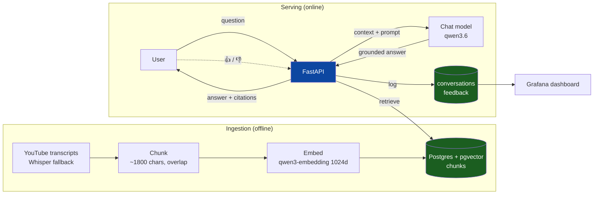
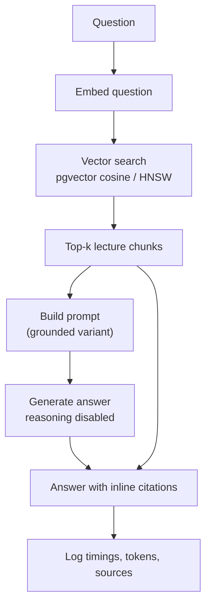

# CS336 Lecture Assistant — RAG over "Language Modeling from Scratch"

A Retrieval-Augmented Generation assistant over Stanford's
[CS336 — Language Modeling from Scratch](https://www.youtube.com/playlist?list=PLoROMvodv4rMqXOcazWaTUHhq-yembLCV)
lecture series (18 lectures, ~29k transcript segments). Ask a question in plain
English; get an answer grounded in the lectures, with inline citations that link
to the **exact second** in the video.

[](https://github.com/guilleserranof/cs336-rag/actions/workflows/ci.yml)

---

## The problem

CS336 is ~40 hours of dense, technical lecture video. If you want to know *"why
is prenorm preferred over postnorm?"* or *"how does FlashAttention save memory?"*,
your options are to re-watch, scrub a timeline, or ask a general chatbot that has
never seen these specific lectures and will happily hallucinate.

This project turns the lecture transcripts into a searchable knowledge base and
puts an LLM in front of it that **answers only from the lectures and cites its
sources**. Every claim links back to the moment in the video it came from, so the
answer is verifiable rather than plausible-sounding. It is a focused study tool
for the course, and a demonstration of a production-shaped RAG system:
ingestion, retrieval, evaluation, a served API + UI, and monitoring.

## What it looks like

Ask a question → get a grounded, cited answer whose `[1]`, `[2]` markers link to
the exact lecture timestamp, plus a source list and a 👍/👎 control:

```
Q: Why is prenorm preferred over postnorm?

Prenorm keeps the residual stream "clean": the LayerNorm sits outside the
residual path, so gradients propagate straight through the backward pass
without being rescaled at every block [1]. Postnorm places the norm inside
the residual stream, which changes the gradient norm as it flows backward and
causes instability in deep networks [2]. ...

Sources:
  [1] Lecture 3: Architectures — youtube.com/watch?v=lVynu4bo1rY&t=531s
  [2] Lecture 3: Architectures — youtube.com/watch?v=lVynu4bo1rY&t=634s
```

## Architecture



The knowledge base (`chunks`) and the telemetry (`conversations`, `feedback`)
live in the same Postgres but are independent: re-ingesting rebuilds the
knowledge base and never touches the usage history the dashboards read.

### Retrieval & answer flow



Vector search is the default because it **won a retrieval evaluation** against
text, hybrid (RRF), and reranking. The "grounded" prompt and reasoning-disabled
generation each **won their own evaluations** too — see
[Evaluation](#evaluation).

## Quick start

Requires Docker (with Compose) and an API key for the OpenAI-compatible endpoint.

```bash
git clone https://github.com/guilleserranof/cs336-rag.git
cd cs336-rag
cp .env.example .env          # then put your OPENAI_KEY in .env

docker compose up -d          # postgres + app + grafana

# one-time: build the knowledge base from the committed transcripts
docker compose run --rm app cs336-rag ingest
```

Then open:

| | URL |
|---|---|
| Web UI | <http://localhost:8000> |
| API docs (Swagger) | <http://localhost:8000/docs> |
| Grafana dashboard | <http://localhost:3000> |

The lecture transcripts are committed under [`data/raw/`](data/raw), so the
knowledge base is rebuilt from the repo — no YouTube access needed. Ingestion
embeds ~800 chunks and takes about a minute.

Full instructions (local dev without Docker, configuration, troubleshooting) are
in **[docs/setup.md](docs/setup.md)**; everything you can *do* with it (CLI, API,
evaluations) is in **[docs/usage.md](docs/usage.md)**.

## Highlights

- **Grounded, cited answers.** Inline `[n]` markers link to the exact lecture
  second; the prompt refuses to answer beyond the retrieved context.
- **Every design decision is measured, not assumed.** Retrieval method, prompt
  variant, and generation mode were each chosen by a reproducible evaluation with
  committed results ([docs/evaluation.md](docs/evaluation.md)).
- **Hybrid search, reranking, and query rewriting** are all implemented, wired
  into the served flow, and evaluated — and each *lost* to plain vector search on
  this corpus, with the evaluation explaining why (a result worth more than
  adopting them uncritically).
- **Automated ingestion** (`cs336-rag ingest`) — YouTube captions with a Whisper
  fallback, chunking, embedding, and an idempotent load into pgvector.
- **Monitoring**: user feedback (👍/👎) plus an 11-panel Grafana dashboard over
  live telemetry ([docs/monitoring.md](docs/monitoring.md)).
- **Full stack in one `docker compose up`**; the app is a slim non-root image.
- **Engineered like production**: red/green TDD, ~170 tests (unit + Postgres
  integration), ruff + mypy (strict), and CI that lints, tests against a real
  pgvector, and builds the image.

## Evaluation

Both retrieval and answer quality are evaluated offline against an LLM-generated
ground-truth set; the winners are wired in as defaults. Full method and
discussion in **[docs/evaluation.md](docs/evaluation.md)**.

**Retrieval** (300 questions, hit rate / MRR) — vector search wins:

| Method | Hit@5 | Hit@10 | MRR |
|---|---|---|---|
| text (FTS) | 0.797 | 0.883 | 0.578 |
| **vector** | **0.973** | **0.990** | **0.869** |
| hybrid (RRF) | 0.963 | 0.983 | 0.796 |
| hybrid + rerank | 0.207 | 0.310 | 0.129 |

**Answer prompts** (LLM judge: relevance, groundedness, citation) — "grounded"
wins; the citation axis is what separates a verifiable answer from a
plausible-but-uncitable one:

| Variant | Relevance | Groundedness | Citation | Overall |
|---|---|---|---|---|
| baseline | 4.83 | 4.90 | 2.80 | 4.18 |
| **grounded** | 4.83 | 4.97 | 4.83 | **4.88** |
| tutor | 4.80 | 4.80 | 4.80 | 4.80 |

Profiling also showed the chat model spent ~95% of wall-clock on internal
reasoning before the first answer token; disabling it cut answer latency from
~60–100 s to ~5–12 s with no loss in judged quality.

## Tech stack

| Concern | Choice |
|---|---|
| Language / tooling | Python 3.12, [uv](https://docs.astral.sh/uv/), ruff, mypy (strict), pytest |
| Knowledge base | Postgres 17 + [pgvector](https://github.com/pgvector/pgvector) (HNSW + GIN FTS) |
| Models | qwen3.6 (chat), qwen3-embedding, rerank, deepseek-v4-flash (judge), Whisper — via an OpenAI-compatible API |
| API / UI | FastAPI + a dependency-free HTML/JS front end |
| Monitoring | Grafana (provisioned datasource + dashboard) |
| Packaging | Docker (multi-stage) + docker-compose |

## Repository layout

```
src/cs336_rag/
  ingest/        transcripts, chunking, embedding, pipeline
  retrieval.py   text / vector / hybrid / rerank + query rewriting
  rag.py         answer flow and prompt variants
  evals/         retrieval and answer evaluations + metrics
  api.py         FastAPI app (ask, feedback, stats, UI)
  conversations.py  telemetry persistence
  db.py, config.py, models.py, llm.py, embeddings.py, service.py
grafana/         provisioned datasource + dashboard
data/raw/        committed lecture transcripts (the dataset)
docs/            setup, usage, evaluation, monitoring
tests/           unit + integration (~170 tests)
```

## Development

```bash
uv sync                       # install deps
docker compose up -d postgres # tests need a pgvector Postgres
make ci                       # lint + format-check + typecheck + tests
```

See [docs/setup.md](docs/setup.md) for the full developer workflow.

## License

MIT — see [LICENSE](LICENSE). Lecture content belongs to Stanford / the CS336
instructors; this project only indexes publicly available transcripts.
